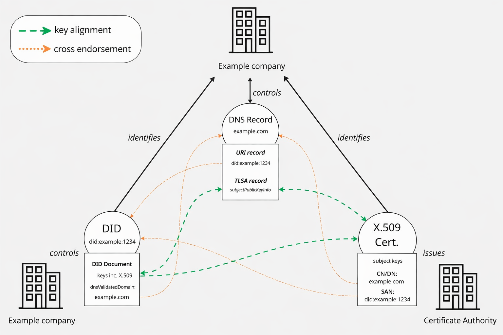

## 6. Identifier Role Taxonomy

*This section is non-normative.*

Each identifier type contributes a specific kind of assurance. Cross-endorsements compose these assurances; they do not transfer or replicate them.

### 6.1. DNS: Naming and Discoverability

DNS provides globally unique, human-readable names resolvable across the internet:

- **Human recognizability.** Domain names are meaningful to end users and correspond to organizational branding.
- **Global discoverability.** DNS is the universal resolution layer of the internet.
- **Integrity (when DNSSEC is deployed).** Cryptographic assurance of record authenticity and integrity.

DNS does not, by itself, prove who controls a domain in any legally meaningful sense.

### 6.2. X.509 Certificates: Domain Ownership via PKI

X.509 certificates operate within a hierarchical trust model governed by Certificate Authorities:

- **Domain ownership attestation.** A CA validates that the certificate subject controls the domain.
- **Organizational identity (for OV/EV certificates).** Higher-assurance certificate profiles may include verified organizational metadata such as legal name, jurisdiction, and LEI.
- **TLS integration.** X.509 certificates are the standard mechanism for securing HTTPS and other TLS-based communications.

X.509 certificates are time-bounded artifacts with defined cryptoperiods, issued, renewed, and revoked under CA governance.

### 6.3. DIDs: Cryptographic Key Control

DIDs follow a controller-managed model:

- **Key control.** DIDs prove that an entity controls one or more cryptographic keys, without requiring CA intermediation.
- **Programmable identity.** DID Documents can express verification methods, service endpoints, and delegation structures.
- **Portability.** DIDs can be managed independently of any single service provider or domain registrar.

DIDs do not inherently prove domain ownership or organizational identity.

### 6.4. Compositional Principle

Identifier Controllers SHOULD design cross-endorsements that leverage each identifier's native strengths. Identifier Controllers SHOULD NOT use cross-endorsement to imply an assurance that is native to another identifier type. A DID cross-endorsed with an X.509 certificate does not inherit CA-attested domain ownership; that assurance belongs to the certificate. An X.509 certificate cross-endorsed with a DID does not inherit the DID's programmable key management; that assurance belongs to the DID.

### 6.5. did:web and Circular Trust

The `did:web` method resolves DID Documents by fetching them from a web server at a domain encoded in the DID itself. The domain owner controls the DID Document. As a consequence, a cross-endorsement between a `did:web` identifier and its own host domain is **circular**: the DID already depends on the domain for its integrity, so the cross-endorsement does not introduce an independent trust anchor.

Identifier Controllers and Verifiers MUST observe the following:

**(a)** A `did:web`-to-own-host-domain cross-endorsement provides discoverability and structural linkage only. Verifiers MUST NOT treat it as providing independent assurance equivalent to a cross-endorsement involving an independently-anchored DID.

**(b)** For independent assurance, the DID method used SHOULD have integrity properties that do not depend solely on the DNS domain (e.g., `did:webvh`, `did:webs`, ledger-based methods, or methods with independent verifiable history).

**(c)** Verifiers MUST consider the DID method's trust properties when assessing the overall assurance level of a HAVID. A HAVID built entirely on `did:web` and its host domain carries strictly lower assurance than one built on a DID method with independent integrity.

### 6.6. Cardinality

A single identifier MAY participate in cross-endorsements with multiple identifiers of the same or different types.

When an identifier participates in multiple cross-endorsements:

**(a)** Each cross-endorsement MUST be independently verifiable.

**(b)** Verifiers MUST NOT infer transitive trust across cross-endorsements. If a DID is cross-endorsed with Domain X and Domain X is cross-endorsed with Certificate Y, the Verifier MUST NOT treat the DID as cross-endorsed with Certificate Y unless a direct, independently verifiable cross-endorsement exists between them.

**(c)** Identifier Controllers SHOULD limit active cross-endorsements to those serving a clear operational purpose.

---

## 7. Threat Model

*This section is non-normative.*

This section identifies the principal adversaries, attack goals, and mitigations relevant to HAVID deployments. Implementers SHOULD use this model to inform their risk assessments.

### 7.1. Adversaries

| Adversary | Capability | Example |
|---|---|---|
| Compromised DNS registrar or zone administrator | Can create, modify, or delete DNS records including `_did` URI records, TLSA records, and DNSSEC keys. | Registrar account takeover; insider threat at DNS hosting provider. |
| Rogue or compromised Certificate Authority | Can issue certificates with arbitrary SANs and organizational metadata. | CA key compromise; policy violation by a subordinate CA. |
| Compromised DID controller private key | Can modify DID Documents, rotate keys, and forge signatures. | Key exfiltration from a poorly secured key store. |
| Network attacker (on-path) | Can intercept, modify, or replay unprotected resolution traffic. | BGP hijack; DNS cache poisoning in the absence of DNSSEC. |
| Correlation attacker | Can observe resolution patterns and public cross-endorsement records to build profiles. | Passive network monitoring; crawling public DNS zones. |

### 7.2. Attack Goals and Mitigations

**Fabricated cross-endorsement.** An attacker creates a unidirectional reference from an identifier they control to an identifier they do not, making it appear that the two are linked. *Mitigation:* Bi-directional cross-endorsement requirement ([Section 9](#9-cross-endorsement)) ensures both sides must assert the link. Verifiers MUST confirm both directions.

**Stale key exploitation.** An attacker obtains a compromised key that remains valid in one system (e.g., a DID Document) after it has been rotated in another (e.g., an X.509 certificate). *Mitigation:* Coordinated key rotation requirements ([Section 10.2](#102-requirements-for-identifier-controllers-1)) and shortest-cryptoperiod rule.

**Trust escalation via transitive inference.** An attacker chains cross-endorsements to imply a relationship that was never directly asserted. *Mitigation:* The no-transitivity rule ([Section 6.6](#66-cardinality)) and maximum reference depth limits ([Section 19.6](#196-loop-and-malicious-binding-prevention)).

**DNS record manipulation.** An attacker modifies `_did` URI or TLSA records to point to attacker-controlled identifiers. *Mitigation:* DNSSEC requirement for DNS-based cross-endorsements ([Section 19.4](#194-dns-integrity)). See also [Section 11.4](#114-dnssec-deployment-considerations) for deployment pragmatics.

**Rogue certificate issuance.** A CA issues a certificate containing a DID URI in the SAN without verifying control of the DID. *Mitigation:* CA validation requirements ([Section 20.1](#201-certificate-policy-requirements-for-cas-resolving-and-verifying-dids)).

**Correlation and linkability.** An observer uses publicly visible cross-endorsement records to correlate identities across contexts. *Mitigation:* Privacy guidance ([Section 21](#21-privacy-considerations)), encrypted DNS, and limiting cross-endorsements to those serving a clear operational purpose.

---

## 8. Architecture Overview

*This section is non-normative.*

This specification defines a compositional architecture for establishing high-assurance linkages between VID types. 



*Figure 1: Cross-endorsement and key alignment between the three VID types in a HAVID.*

The architecture rests on two mechanisms:

- **Cross-endorsement (primary)** creates explicit, machine-readable, bi-directional references between identifiers. Each identifier points to the other using fields and record types native to its own ecosystem. Cross-endorsement provides discoverability, declared intent, and verifiable integrity.

- **Key alignment (supplementary, optional)** provides additional proof of common control by demonstrating possession of the same or verifiably linked key material across systems. Key alignment increases assurance but introduces lifecycle mismatch risk, lowest-common-denominator security reduction, governance role collapse, and increased attack surface. It is OPTIONAL and subject to strict normative requirements.

### 8.1. Relationship to Existing Trust Frameworks

This specification does not define, replace, or modify the trust frameworks that govern individual identifier types. Web PKI continues to govern X.509 certificates. DNSSEC continues to govern DNS record integrity. DID method specifications continue to govern DID operations. Regulatory frameworks (eIDAS, national digital identity schemes) continue to govern legal recognition. GLEIF continues to govern LEI issuance.

A HAVID does not elevate an identifier's trust level beyond what its native framework provides. A DID cross-endorsed with a qualified eIDAS certificate does not itself become a qualified identifier. However, a Verifier can follow the cross-endorsement to discover and validate the qualified certificate, and can compose the assurances of both identifiers in its trust decision.

---

## 9. Cross-Endorsement

*This section is normative.*

Cross-endorsement is the primary mechanism for linking VID types. It is established through explicit, bi-directional references between identifiers, using fields and record types native to each identifier's ecosystem.

### 9.1. Requirements for Identifier Controllers

To establish a cross-endorsement between two identifiers, an Identifier Controller:

**(a)** MUST include an explicit reference to each identifier within the other's native metadata or record format, using the mechanisms defined in Sections 11 through 13 for each identifier pairing.

**(b)** MUST ensure that references are persistently and reliably hosted for the duration of the cross-endorsement.

**(c)** MUST store references in integrity-protected formats where available. For DNS records, this means DNSSEC (see [Section 11.4](#114-dnssec-deployment-considerations) for deployment guidance). For X.509 certificates, this means CA-signed extensions. For DID Documents, this means the integrity mechanisms provided by the DID method.

**(d)** SHOULD implement access control policies governing who can write or update references.

**(e)** SHOULD define governance procedures for how references are verified, updated, and revoked over time.

### 9.2. Requirements for Verifiers

To verify a cross-endorsement, a Verifier:

**(a)** MUST resolve both identifiers using their native resolution mechanisms.

**(b)** MUST confirm that each identifier contains a reference to the other (bi-directional cross-endorsement).

**(c)** MUST validate the integrity of each reference (DNSSEC validation, certificate chain validation, DID method integrity).

**(d)** MUST check the current validity of each identifier (not expired, not revoked, not deactivated).

For handling partial or failed validation states, see [Section 15](#15-validation-states-and-verifier-guidance).

### 9.3. Lifecycle

Cross-endorsements are subject to the lifecycle of each participating identifier:

**(a)** If an identifier is revoked, expired, or deactivated, the cross-endorsement MUST be treated as invalid by Verifiers.

**(b)** When an identifier is updated (e.g., a certificate is renewed or a DID Document is modified), the Identifier Controller MUST preserve or re-establish cross-endorsement references.

**(c)** Verifiers SHOULD define re-validation intervals appropriate to their risk model.

---

## 10. Key Alignment

*This section is normative.*

Key alignment is an OPTIONAL, supplementary mechanism that provides additional proof of common control by demonstrating that the same or verifiably linked cryptographic key material is present across multiple identifiers.

### 10.1. When Key Alignment is Appropriate

An Identifier Controller MAY establish key alignment when all of the following conditions are met:

**(a)** The participating identifier systems share compatible cryptographic formats and algorithms.

**(b)** The key rotation schedules and cryptoperiods are compatible or can be explicitly coordinated.

**(c)** The Identifier Controller has assessed and accepted the risks described in [Section 8](#8-architecture-overview) and the threat model in [Section 7](#7-threat-model).

An Identifier Controller SHOULD NOT establish key alignment when:

**(a)** The participating systems have significantly different cryptoperiods (e.g., short-lived TLS certificates and long-lived DIDs) and the Identifier Controller cannot commit to synchronized key rotation.

**(b)** Using the same key would collapse governance boundaries or operational roles that should remain distinct.

**(c)** Cross-endorsement alone provides sufficient assurance for the intended use case.

### 10.2. Requirements for Identifier Controllers

When key alignment is implemented, the Identifier Controller:

**(a)** MUST ensure the key material is identical across all representations. This means byte-for-byte equivalence of public key material after normalization to a common encoding. Keys that are merely compatible (e.g., same curve but different keys) do not satisfy this requirement.

**(b)** MUST coordinate key rotation across all systems in which the key is used. When a key is rotated in any one system, it MUST be rotated in all systems, or the key alignment MUST be explicitly dissolved.

**(c)** MUST treat the effective cryptoperiod of the shared key as the shortest cryptoperiod among all participating systems.

**(d)** MUST document which systems share key material and maintain an auditable record of key alignment relationships.

**(e)** SHOULD monitor for key compromise indicators across all participating systems.

### 10.3. Requirements for Verifiers

To verify key alignment, a Verifier:

**(a)** MUST extract the public key from each identifier (DID Document `verificationMethod`, X.509 certificate subject public key, or DNS TLSA record).

**(b)** MUST confirm that the keys are identical by byte-for-byte comparison after normalization.

**(c)** MUST verify that the key is currently valid in all participating systems, not just one.

**(d)** MAY request proof of possession (see [Section 10.4](#104-proof-of-possession)).

### 10.4. Proof of Possession

Where key alignment is used, Verifiers MAY request proof of possession through:

**Challenge-Response.** The Verifier issues a nonce or timestamped challenge. The entity signs it using the private key. The Verifier confirms the signature against the public key as represented in each identifier system.

**Protocol-Based Proofs.** Mutual TLS, ACME challenges, DIDComm authentication, or other protocol-specific methods MAY be used, provided they establish proof of possession and are verifiable across the relevant identifier representations.

### 10.5. Failure Scenario: Key Alignment Without Lifecycle Coordination

*This section is non-normative.*

Consider an organization that uses the same RSA key pair in both a DID Document and a Let's Encrypt TLS certificate for `org.example.com`. The certificate has a 90-day validity period. After 90 days, the certificate expires and is renewed with a new key pair, as is recommended practice.

At this point the DID Document still contains the old public key while the TLS certificate contains a new one. A Verifier checking key alignment will find a mismatch. If the old key is later compromised, an attacker could present the DID Document's stale key as valid, since the DID has not been updated.

This scenario illustrates why key alignment MUST be accompanied by coordinated rotation (Section 10.2(b)) and why the effective cryptoperiod MUST track the shortest-lived system (Section 10.2(c)). When these requirements cannot be met, cross-endorsement without key alignment is the safer choice.

---

## 11. Bridging DIDs and DNS

*This section is normative.*

DIDs and DNS represent fundamentally different identification models. Cross-endorsement between these systems combines the cryptographic assurances of DIDs with the global discoverability of DNS domains. These mechanisms are defined in [High Assurance DIDs with DNS].

### 11.1. Cross-Endorsement: DID to DNS

The method for establishing a DID-to-DNS reference depends on the DID method.

#### 11.1.1. Web-Based DIDs

For `did:web` identifiers, the association to a DNS domain is inherent in the DID syntax, which encodes the domain used to resolve the DID Document.

**Example:**

```
DID: did:web:example.ca
Resolves to: https://example.ca/.well-known/did.json
Domain: example.ca
```

See [Section 6.5](#65-didweb-and-circular-trust) for the trust implications of this inherent dependency.

#### 11.1.2. Non-Web-Based DIDs

For DID methods other than `did:web`, the Identifier Controller MUST establish a DNS reference using the `dnsValidationDomain` property defined in [DID Extensions] and formalized in [High Assurance DIDs with DNS].

**Example:**

```json
{
  "dnsValidationDomain": "example.ca"
}
```

#### 11.1.3. Summary

| DID Type | DID Document Property | Resolves to DNS Domain |
|---|---|---|
| Web-based DID methods | `"id": "did:web:example.ca"` | `example.ca` |
| Non-web-based DID methods | `"dnsValidationDomain": "..."` | `example.ca` |

### 11.2. Cross-Endorsement: DNS to DID

To complete the cross-endorsement from the DNS side, the Identifier Controller MUST publish a URI record in the domain's DNS zone at the `_did.` subdomain prefix. This mechanism is defined in [High Assurance DIDs with DNS], originally proposed in [DID Method Discovery using DNS].

**Example DNS record:**

```
_did.example.ca.  IN  URI  10  1  "did:web:example.ca"
```

The DNS zone containing the URI record MUST be integrity-protected (see [Section 11.4](#114-dnssec-deployment-considerations)).

| DNS Query Target | Record Type | Returns |
|---|---|---|
| `_did.<domain>` | URI | The associated DID |

### 11.3. Key Alignment: DID and DNS (Optional)

Where key alignment is desired between a DID and a DNS domain, it is established by:

**(a)** Publishing the public key in the DID Document via a `verificationMethod`.

**(b)** Publishing a corresponding TLSA record in DNS, as defined in Section 3.4 of [High Assurance DIDs with DNS], binding the domain to the same public key.

Both the DID Document and the DNS zone are mutable. Therefore:

- DNS integrity MUST be ensured via DNSSEC.
- DID integrity MAY be ensured via `dataIntegrityProof`, verifiable history logs (e.g., `did:webvh`, `did:webs`), or other method-specific integrity mechanisms.

All normative requirements of [Section 10](#10-key-alignment) apply.

### 11.4. DNSSEC Deployment Considerations

*This section is non-normative.*

This specification requires integrity protection for DNS-based cross-endorsements. DNSSEC is the normative mechanism for achieving this. However, DNSSEC deployment remains uneven: some TLDs, registrars, and managed DNS providers offer limited or no DNSSEC support.

Identifier Controllers operating in environments where DNSSEC is not yet available SHOULD:

**(a)** Prioritize registrars and DNS providers that support DNSSEC signing and DS record publication.

**(b)** Document the absence of DNSSEC in their operational security assessment and treat the resulting HAVID as carrying reduced DNS-side integrity assurance.

**(c)** Consider compensating controls such as CAA records, DANE-TA pinning (where the CA supports it), or monitoring for unauthorized DNS changes.

Verifiers encountering DNS-based cross-endorsement records without DNSSEC validation MUST treat those records as integrity-unverified. This corresponds to State 5 (Integrity Failure) in [Section 15](#15-validation-states-and-verifier-guidance). Verifiers MAY accept such records with reduced assurance if their risk model explicitly permits it, but MUST NOT treat them as equivalent to DNSSEC-validated records.

The HAVID ecosystem SHOULD track DNSSEC adoption trends and revisit this guidance as deployment matures.

---

## 12. Bridging DNS and X.509

*This section is normative.*

The relationship between DNS and X.509 is the most established of the three pairings. Domain-validated X.509 certificates bind a public key to a DNS domain name, forming the foundation of Web PKI and TLS.

### 12.1. Cross-Endorsement: X.509 to DNS

X.509 certificates reference DNS domains through the **Subject Alternative Name (SAN)** extension, as defined in [RFC 6125, Section 6.4.4]. The legacy practice of using the Common Name (CN) field ([RFC 5280, Section 4.1.2.6]) is deprecated for this purpose.

| Bridge Point | Field Type | DNS Domain |
|---|---|---|
| Preferred | SAN | `example.ca` |
| Legacy (deprecated) | CN | `example.ca` |

### 12.2. Cross-Endorsement: DNS to X.509

DNS can explicitly endorse an X.509 certificate using DANE ([RFC 6698]), which publishes certificate assertions via TLSA records.

An Identifier Controller establishes a DNS-to-X.509 cross-endorsement by:

**(a)** Publishing a TLSA record at a service-specific DNS name (e.g., `_443._tcp.example.com`) containing the hash or raw data of the X.509 certificate or its public key.

**(b)** Protecting the DNS zone with DNSSEC (see [Section 11.4](#114-dnssec-deployment-considerations)).

A Verifier confirms the cross-endorsement by:

**(a)** Retrieving the TLSA record and validating the DNSSEC signature chain.

**(b)** Retrieving the X.509 certificate presented over TLS.

**(c)** Confirming that the certificate matches the TLSA assertion.

| DNS Domain | TLSA Record | Selector | Matching Type | Description |
|---|---|---|---|---|
| `example.ca` | `TLSA 3 0 1 3d0a67fc...` | 0 (Full Cert) | 1 (SHA-256) | Matches the entire certificate or its hash |
| `example.ca` | `TLSA 3 1 1 3d0a67fc...` | 1 (Public Key) | 1 (SHA-256) | Matches the public key or its hash |

### 12.3. Note on Key Alignment

In the DNS/X.509 pairing, key alignment is inherent: the X.509 certificate contains the public key, and the TLSA record references either the certificate or the key. Because the certificate's cryptoperiod naturally governs the key's validity, lifecycle alignment is more naturally managed in this pairing than in the others. The normative requirements of [Section 10](#10-key-alignment) still apply.

---

## 13. Bridging DIDs and X.509

*This section is normative.*

DIDs and X.509 certificates both use public/private key pairs, but they serve fundamentally different purposes. Cross-endorsement between these systems allows an entity to demonstrate that its DID and its X.509 certificate are controlled by the same party. This composes the CA-attested identity of the certificate with the key management capabilities of the DID. It does not transfer trust properties between them.

### 13.1. Cross-Endorsement: DID to X.509

An Identifier Controller establishes a DID-to-X.509 cross-endorsement by including a reference to the X.509 certificate within a `verificationMethod` in the DID Document.

Requirements:

**(a)** The `verificationMethod` MUST be of type `JsonWebKey2020` (or a compatible type supporting JWK representation).

**(b)** The public key MUST be expressed using the `publicKeyJwk` property.

**(c)** The corresponding X.509 certificate MUST be included via one of the following JWK parameters:

- `x5u`: a URI pointing to a retrievable resource containing the X.509 certificate or certificate chain.
- `x5c`: an array of base64-encoded DER certificates, representing a standalone certificate or a complete chain.

**Example DIDs with X.509 Certificates in DID Documents:**

| DID | Comment |
|---|---|
| `did:web:danubetech.com:did:test4` | Uses `x509CertificateChain` |
| `did:web:danubetech.com:did:test4-jwk` | Uses `x5c` in `publicKeyJwk` |
| `did:web:danubetech.com:did:test5` | Uses `x509CertificateChain` |
| `did:web:danubetech.com:did:test5-jwk` | Uses `x5c` in `publicKeyJwk` |
| `did:web:danubetech.com:did:test6` | Uses `x509CertificateChain` |
| `did:web:danubetech.com:did:test6-jwk` | Uses `x5c` in `publicKeyJwk` |

These can be resolved via the Universal Resolver.

### 13.2. Cross-Endorsement: X.509 to DID

An X.509-to-DID cross-endorsement is established by including the DID as a URI within the certificate's **Subject Alternative Name (SAN)** extension.

**Example:**

```
X509v3 Subject Alternative Name:
    URI:did:example:123456789abcdefghi
```

Requirements:

**(a)** The DID MUST appear as a URI in the SAN extension.

**(b)** The DID MUST follow the syntax rules of the relevant DID method.

**(c)** The DID MUST be the only DID in the SAN, or clearly identifiable if multiple URIs are present.

Certificate Authorities issuing certificates with DID URIs in the SAN MUST follow the requirements in [Section 20.1](#201-certificate-policy-requirements-for-cas-resolving-and-verifying-dids).

### 13.3. Key Alignment: DID and X.509 (Optional)

Key alignment between a DID and an X.509 certificate is established by confirming that the public key in the DID Document's `verificationMethod` is identical to the public key in the X.509 certificate.

This pairing carries the **highest lifecycle mismatch risk** of the three pairings defined in this specification. X.509 certificates, particularly DV certificates, increasingly have short cryptoperiods (90 days or less). DIDs are often designed for longer-lived key relationships. See [Section 10.5](#105-failure-scenario-key-alignment-without-lifecycle-coordination) for a concrete failure scenario.

When key alignment is implemented for this pairing:

**(a)** All normative requirements of [Section 10](#10-key-alignment) apply.

**(b)** The effective cryptoperiod of the shared key MUST be treated as no longer than the certificate's validity period.

**(c)** When the certificate is renewed with new key material, the Identifier Controller MUST update the DID Document to reflect the new key, or MUST explicitly dissolve the key alignment relationship.

**(d)** Identifier Controllers SHOULD evaluate whether cross-endorsement alone provides sufficient assurance before introducing the complexity of synchronized keys.

---

## 14. Resolution and Dereferencing

*This section is normative.*

This section defines how a Verifier resolves a known VID, traverses cross-endorsement references, and validates the resulting linkages.

### 14.1. Starting Point

Resolution begins from one known VID (a DID, DNS domain, or X.509 certificate). From this starting point, the Verifier follows cross-endorsement references to discover and validate associated identifiers.

### 14.2. Resolution Flows

#### 14.2.1. Starting from a DID

**Step 1.** Resolve the DID Document using a conformant DID resolver.

**Step 2.** Inspect `verificationMethod` entries: if `dnsValidationDomain` is present, extract the associated DNS domain. If `x5u` or `x5c` parameters are included in a `publicKeyJwk`, extract the referenced X.509 certificate.

**Step 3.** For each discovered identifier, verify the reverse cross-endorsement: for DNS, query `_did.<domain>` URI record and validate DNSSEC; for X.509, inspect the SAN for the DID URI and validate the certificate chain.

**Step 4.** Optionally, verify key alignment per [Section 10](#10-key-alignment).

#### 14.2.2. Starting from a DNS Domain

**Step 1.** Query for `_did.<domain>` URI record. If present, retrieve the associated DID. Validate DNSSEC.

**Step 2.** Query for TLSA records (e.g., `_443._tcp.<domain>`). If present, note for certificate comparison.

**Step 3.** If a DID was discovered, resolve it and verify the reverse reference (`dnsValidationDomain` or `did:web` domain match).

**Step 4.** If a TLS connection is established, compare the presented certificate against the TLSA record.

**Step 5.** Optionally, verify key alignment per [Section 10](#10-key-alignment).

#### 14.2.3. Starting from an X.509 Certificate

**Step 1.** Inspect the Subject Alternative Name (SAN) for DNS names and DID URIs.

**Step 2.** For DID URIs: resolve the DID Document and verify the reverse reference (`x5u` or `x5c` pointing back to this certificate).

**Step 3.** For DNS names: query for `_did.` URI records and TLSA records.

**Step 4.** Validate the certificate chain against trusted root stores.

**Step 5.** Optionally, verify key alignment per [Section 10](#10-key-alignment).

### 14.3. Resolution Behavior

Implementations SHOULD define timeout and retry policies for each resolution step. When one leg of a multi-identifier HAVID fails while others succeed, the Verifier MUST treat the failed leg as unresolved and assess the remaining identifiers according to the validation states in [Section 15](#15-validation-states-and-verifier-guidance). Implementations MUST NOT block indefinitely on any single resolution step.

Verifiers MUST enforce a maximum cross-endorsement reference depth of 2 when traversing from any single starting identifier. That is, a Verifier starting from Identifier A may follow a cross-endorsement to Identifier B and from B to Identifier C, but MUST NOT follow further references from C to discover Identifier D for the purpose of HAVID validation. Each link in the chain MUST be independently validated; depth-limited traversal does not exempt any reference from the requirements of [Section 9.2](#92-requirements-for-verifiers).

### 14.4. Establishing High Assurance

To establish a HAVID, the Verifier MUST confirm:

**(a)** **Bi-directional cross-endorsement.** Both identifiers reference each other through their native mechanisms.

**(b)** **Integrity.** Each reference is integrity-protected (DNSSEC for DNS, CA chain for X.509, DID method integrity for DID Documents).

**(c)** **Validity.** Each identifier is currently valid (not expired, not revoked, not deactivated).

A HAVID may link two identifiers (e.g., DID and DNS only) or three (DID, DNS, and X.509). A two-identifier HAVID is valid provided the requirements above are met for that pair. Verifiers SHOULD consider the number and diversity of cross-endorsed identifiers when assessing overall assurance.

### 14.5. Caching and Expiry

Verifiers SHOULD respect TTLs for DNS records and expiration periods for X.509 certificates. DID Documents MAY change over time; Verifiers SHOULD define caching policies appropriate to their risk model. Verifiers MUST NOT rely on cached data for high-assurance validation without confirming that cached records are within their validity period.

---

## 15. Validation States and Verifier Guidance

*This section is normative.*

### 15.1. Validation State Definitions

**State 1: Full HAVID.**
Bi-directional cross-endorsement confirmed. Key alignment verified (where used). All integrity checks pass. All identifiers currently valid.
*Verifier action:* Accept. Highest assurance.

**State 2: Cross-Endorsed HAVID.**
Bi-directional cross-endorsement confirmed. Key alignment not used. All integrity checks pass. All identifiers currently valid.
*Verifier action:* Accept. Standard assurance.

**State 3: Partial Endorsement.**
Only unidirectional reference found (one identifier references the other, but the reverse is missing or unresolvable). Integrity passes on the available side. All identifiers currently valid.
*Verifier action:* MUST NOT treat as a full HAVID. MAY accept with reduced assurance if the Verifier's risk model permits. SHOULD log for investigation.

**State 4: Key Alignment Failure.**
Bi-directional cross-endorsement may be present, but key material does not match across identifiers.
*Verifier action:* MUST NOT accept any key alignment claim. The cross-endorsement MAY still be valid independently if it satisfies the requirements for State 1 or 2 without relying on key alignment. SHOULD alert for potential lifecycle desynchronization.

**State 5: Integrity Failure.**
One or more integrity checks fail (DNSSEC validation failure, certificate chain validation failure, DID method integrity failure).
*Verifier action:* MUST NOT accept as HAVID. MUST treat the unverifiable reference as untrusted.

**State 6: Expired or Revoked.**
One or more participating identifiers are expired, revoked, or deactivated.
*Verifier action:* MUST NOT accept as HAVID. The Identifier Controller must re-establish the cross-endorsement with valid identifiers.

**State 7: No Endorsement.**
No cross-endorsement references found between the identifiers.
*Verifier action:* No HAVID exists.

### 15.2. Handling Degraded States

When a Verifier encounters a degraded state (States 3 through 6):

**(a)** The Verifier MUST NOT silently promote a degraded state to full HAVID assurance.

**(b)** The Verifier SHOULD surface the specific failure to the relying application.

**(c)** The Verifier MAY re-attempt resolution after a brief interval to account for temporary failures or propagation delays, but MUST NOT retry indefinitely.

**(d)** The Verifier SHOULD log degraded states for audit and monitoring purposes.

### 15.3. Transitional States

During key rotation, certificate renewal, or DID Document updates, a HAVID may temporarily enter a degraded state. Identifier Controllers SHOULD coordinate updates to minimize the window in which cross-endorsement references or key alignment are inconsistent. Verifiers SHOULD apply a short grace period (commensurate with their risk model) before treating a previously valid HAVID as failed, to accommodate propagation delays.

---

## 16. Identifying the Real-World Organization Behind an Identifier

*This section is normative.*

### 16.1. How Each Identifier Contributes

**X.509 Certificates** MAY contain organizational identifiers such as LEI (in `subject:organizationIdentifier`, per ISO 17442-2), VAT numbers, company registration numbers, or other national business identifiers.

**DIDs** can reference an X.509 certificate via cross-endorsement, allowing Verifiers to follow the linkage to the certificate's organizational metadata. DIDs MAY also reference legal entity information in `serviceEndpoint` entries.

**DNS** MAY publish organizational identifiers directly using standardized record types. RFC 9108 defines a method for publishing LEIs using NAPTR records with a `_lei.` prefix:

```
_lei.example.org.  IN  NAPTR  100  10  "u"  "lei+https"
    "!^.*$!https://lei-lookup.gleif.org/api/v1/lei/5493001KJTIIGC8Y1R12!"  .
```

### 16.2. Resolution to a Legal Person

To identify the organization controlling a VID, a Verifier SHOULD:

**(a)** Start from a known identifier.

**(b)** Resolve linked identifiers via cross-endorsement (per [Section 14](#14-resolution-and-dereferencing)).

**(c)** Extract organizational identifiers from the X.509 certificate subject or extensions, or from DNS NAPTR records.

**(d)** Query the appropriate registry (e.g., GLEIF API for LEIs, national business registries for others) to retrieve verified organizational metadata.

### 16.3. Organizational Identity is Not Required for a HAVID

A HAVID does not require the presence of an organizational identifier. A HAVID is established by cross-endorsement (and optionally key alignment) between identifiers. Organizational identity resolution is an additional, valuable step that Verifiers MAY perform when the participating identifiers contain or reference organizational identifiers.

The organizational identity assurance available through a HAVID is bounded by the assurance level of the certificate profile used. A DV certificate provides no organizational identity. An OV or EV certificate, or a qualified certificate under eIDAS, provides increasing levels of attested organizational information.

---

## 17. Worked Examples

*This section is non-normative.*

> **Note on `did:webvh` syntax:** The `did:webvh` method requires a Self-Certifying Identifier (SCID) as the first element of the method-specific identifier. The format is `did:webvh:<SCID>:<domain>:<optional-path>`. The SCID is a globally unique value derived from the DID's initial log entry. In the examples below, `z6Mkf5rGMoatrSj1f` is used as a placeholder SCID. See the [did:webvh specification](https://identity.foundation/didwebvh/) for full details.

### 17.1. Full HAVID: Three-Identifier Cross-Endorsement

This example illustrates a complete HAVID established by a fictional organization, Acme Corp.

#### 17.1.1. Acme Corp's Identifiers

| Identifier Type | Value | Purpose |
|---|---|---|
| DNS Domain | `acme-corp.example` | Public-facing domain; DNSSEC-signed |
| X.509 Certificate | EV certificate for `acme-corp.example` | Domain ownership + organizational identity (includes LEI) |
| DID | `did:webvh:z6Mkf5rGMoatrSj1f:acme-corp.example:org` | Cryptographic key control + service endpoints |

Acme Corp's EV certificate includes:

- SAN: `DNS:acme-corp.example`
- SAN: `URI:did:webvh:z6Mkf5rGMoatrSj1f:acme-corp.example:org`
- Subject organizationIdentifier: `LEI 5493001KJTIIGC8Y1R12`

#### 17.1.2. Cross-Endorsement Records

**DID Document** (`did:webvh:z6Mkf5rGMoatrSj1f:acme-corp.example:org`):

```json
{
  "@context": ["https://www.w3.org/ns/did/v1"],
  "id": "did:webvh:z6Mkf5rGMoatrSj1f:acme-corp.example:org",
  "dnsValidationDomain": "acme-corp.example",
  "verificationMethod": [{
    "id": "did:webvh:z6Mkf5rGMoatrSj1f:acme-corp.example:org#key-1",
    "type": "JsonWebKey2020",
    "controller": "did:webvh:z6Mkf5rGMoatrSj1f:acme-corp.example:org",
    "publicKeyJwk": {
      "kty": "EC",
      "crv": "P-256",
      "x": "f83OJ3D2xF1Bg8vub9tLe1gHMzV76e8Tus9uPHvRVEU",
      "y": "x_FEzRu9m36HLN_tue659LNpXW6pCyStikYjKIWI5a0",
      "x5u": "https://acme-corp.example/.well-known/cert.pem"
    }
  }],
  "service": [{
    "id": "did:webvh:z6Mkf5rGMoatrSj1f:acme-corp.example:org#api",
    "type": "APIEndpoint",
    "serviceEndpoint": "https://acme-corp.example/api/v1"
  }]
}
```

**DNS Records** (DNSSEC-signed zone for `acme-corp.example`):

```
; DID cross-endorsement
_did.acme-corp.example.  IN  URI  10  1  "did:webvh:z6Mkf5rGMoatrSj1f:acme-corp.example:org"

; LEI publication
_lei.acme-corp.example.  IN  NAPTR  100  10  "u"  "lei+https"
    "!^.*$!https://lei-lookup.gleif.org/api/v1/lei/5493001KJTIIGC8Y1R12!"  .

; DANE/TLSA for TLS certificate
_443._tcp.acme-corp.example.  IN  TLSA  3  1  1  a2b3c4d5e6f7...
```

**X.509 Certificate** (issued by a CA):

```
Subject: CN=acme-corp.example, O=Acme Corp,
         organizationIdentifier=LEI:5493001KJTIIGC8Y1R12
X509v3 Subject Alternative Name:
    DNS:acme-corp.example
    URI:did:webvh:z6Mkf5rGMoatrSj1f:acme-corp.example:org
```

#### 17.1.3. Verification Walkthrough

A Verifier starts from the DID `did:webvh:z6Mkf5rGMoatrSj1f:acme-corp.example:org`.

**Step 1: Resolve the DID Document.** The Verifier retrieves the DID Document and extracts `dnsValidationDomain: "acme-corp.example"` and the `x5u` certificate reference.

**Step 2: Verify DNS cross-endorsement.** The Verifier queries `_did.acme-corp.example` for a URI record. It returns the DID. The Verifier validates the DNSSEC chain. Bi-directional cross-endorsement confirmed between DID and DNS.

**Step 3: Verify X.509 cross-endorsement.** The Verifier retrieves the certificate from `x5u`. It inspects the SAN and finds the DID URI. The Verifier validates the certificate chain against its trusted root store. Bi-directional cross-endorsement confirmed between DID and X.509.

**Step 4: Extract organizational identity.** From the X.509 certificate, the Verifier extracts LEI `5493001KJTIIGC8Y1R12`. The Verifier queries the GLEIF API and retrieves Acme Corp's legal name, registration jurisdiction, and status.

**Step 5 (optional): Verify key alignment.** The Verifier compares the public key in the DID Document's `verificationMethod` against the public key in the X.509 certificate and the hash in the DNS TLSA record. If all match, key alignment is confirmed.

**Result:** Full HAVID (State 1) linking the DID, the DNS domain, and the EV certificate, with organizational identity traced to Acme Corp via LEI.

#### 17.1.4. What Each Identifier Contributed

| Identifier | Assurance Contributed |
|---|---|
| DNS (`acme-corp.example`) | Human-readable naming, global discoverability, DNSSEC integrity |
| X.509 (EV certificate) | CA-attested domain ownership, verified organizational identity (LEI) |
| DID (`did:webvh:z6Mkf5rGMoatrSj1f:...`) | Cryptographic key control, service endpoint discovery, verifiable history |

No single identifier provides all of these assurances. The HAVID is the composite.

### 17.2. Degraded State: Unidirectional Endorsement

#### 17.2.1. Scenario

A Verifier starts from the DNS domain `partner-org.example`. The Verifier queries `_did.partner-org.example` and retrieves a URI record pointing to `did:key:z6Mkf5rGMoatr...`

The Verifier resolves the DID Document. The DID Document does not contain a `dnsValidationDomain` property referencing `partner-org.example`.

#### 17.2.2. Assessment

DNS references the DID (forward endorsement exists). The DID does not reference the DNS domain (reverse endorsement is missing). This is **State 3: Partial Endorsement**.

#### 17.2.3. Verifier Action

The Verifier MUST NOT treat this as a full HAVID. The missing reverse reference means the Verifier cannot confirm that the DID controller has endorsed the relationship. Possible explanations include a configuration gap, a potential impersonation attempt (the DNS record was published by someone other than the DID controller), or a compatibility gap (the DID method does not support `dnsValidationDomain`).

The Verifier MAY accept with reduced assurance if its risk model permits, but SHOULD log the incomplete state and SHOULD NOT present this to relying applications as equivalent to a validated HAVID.

### 17.3. Two-Identifier HAVID: DID and DNS Only

Not every use case requires all three identifier types. An Identifier Controller MAY establish a HAVID using only two identifiers.

In this example, an organization establishes cross-endorsement between `did:webvh:z6Mkq9rTNpaYj3x:services.example:id` and the domain `services.example`, without an X.509 certificate participating in the HAVID. (The domain will have a TLS certificate for HTTPS, but it does not carry a DID URI in its SAN and is not formally cross-endorsed with the DID.)

The DID Document includes `dnsValidationDomain: "services.example"`. The DNS zone includes `_did.services.example. IN URI 10 1 "did:webvh:z6Mkq9rTNpaYj3x:services.example:id"`. DNSSEC is enabled.

A Verifier confirms bi-directional cross-endorsement, validates DNSSEC integrity, and establishes a **Cross-Endorsed HAVID (State 2)**. This HAVID provides cryptographic key control (via the DID) and human-readable discoverability (via DNS), but does not provide CA-attested organizational identity. The Verifier SHOULD consider the reduced breadth of assurance when making trust decisions.

### 17.4. Failure Cascade: Multiple Simultaneous Degradations

This example illustrates a realistic scenario in which several things go wrong at once, requiring a Verifier to apply multiple validation states from [Section 15](#15-validation-states-and-verifier-guidance).

#### 17.4.1. Scenario

MegaBank recently completed an infrastructure migration. During the migration, the following occurred:

1. **DNS zone re-signing lapsed.** The migration to a new DNS provider introduced a gap in DNSSEC signing. The `_did.megabank.example` URI record exists and points to `did:webvh:z6MkpT9StBU:megabank.example:id`, but the zone is currently unsigned.

2. **X.509 certificate expired.** The EV certificate for `megabank.example` expired three days ago. The renewal is in progress but has not yet completed. The expired certificate contains `URI:did:webvh:z6MkpT9StBU:megabank.example:id` in its SAN.

3. **DID Document was updated with a new key.** As part of the migration, MegaBank rotated its DID key material. The DID Document now contains a new `verificationMethod` with a new public key. The `x5u` reference still points to the expired certificate. The `dnsValidationDomain` is still set to `megabank.example`.

#### 17.4.2. Verifier Walkthrough

A Verifier starts from the DID `did:webvh:z6MkpT9StBU:megabank.example:id`.

**Step 1: Resolve the DID Document.** Succeeds. The DID Document is well-formed and the `did:webvh` log verifies correctly. The Verifier extracts `dnsValidationDomain: "megabank.example"` and the `x5u` certificate reference.

**Step 2: Verify DNS cross-endorsement.** The Verifier queries `_did.megabank.example`. The URI record exists and points back to the DID. However, DNSSEC validation fails because the zone is unsigned. **Result: State 5 (Integrity Failure) for the DNS leg.** The Verifier records that bi-directional references exist but the DNS side cannot be integrity-verified.

**Step 3: Verify X.509 cross-endorsement.** The Verifier retrieves the certificate from `x5u`. The SAN contains the DID URI (bi-directional reference exists). However, the certificate expired three days ago. **Result: State 6 (Expired or Revoked) for the X.509 leg.**

**Step 4: Assess key alignment.** The DID Document contains a new public key. The expired certificate contains the old public key. The keys do not match. **Result: State 4 (Key Alignment Failure)** if key alignment was being relied upon.

#### 17.4.3. Overall Assessment

The Verifier has encountered three concurrent failures:

| Leg | References | Integrity | Validity | State |
|---|---|---|---|---|
| DID to DNS | Bi-directional | DNS unsigned (DNSSEC lapsed) | DID valid; DNS record present | State 5 |
| DID to X.509 | Bi-directional | Certificate chain valid (but expired) | Certificate expired | State 6 |
| Key alignment | N/A | N/A | Keys do not match | State 4 |

Per [Section 15.2](#152-handling-degraded-states), the Verifier MUST NOT promote any of these to full HAVID assurance. The Verifier SHOULD surface all three failures to the relying application, log the degraded states, and MAY re-attempt after an interval to allow MegaBank to complete its migration.

Critically, the DID itself remains valid and its `did:webvh` verifiable history checks out. A relying application that only needs to verify DID control can still rely on the DID directly. But the HAVID, the composite structure linking all three identifiers, is currently broken and will remain so until MegaBank re-signs its DNS zone and installs the renewed certificate.

#### 17.4.4. Recovery Path

To restore the HAVID, MegaBank must:

1. Complete DNSSEC re-signing of the `megabank.example` zone.
2. Install the renewed EV certificate, ensuring the SAN still contains the DID URI.
3. Update the DID Document's `x5u` to reference the new certificate.
4. If key alignment is desired, ensure the new certificate's public key matches the DID Document's current `verificationMethod`.

Until all four steps are complete, the HAVID remains in a degraded state.

---

## 18. Extending HAVID to New Identifier Types

*This section is non-normative.*

The cross-endorsement pattern is designed to be extensible. A specification defining HAVID support for a new VID type SHOULD address the following elements:

**(1) Structured metadata or record format.** The identifier system must provide a mechanism for embedding machine-readable references to other identifiers (analogous to SAN extensions in X.509, URI records in DNS, or `verificationMethod` entries in DID Documents).

**(2) Integrity protection.** A mechanism for ensuring the authenticity and tamper-resistance of stored references.

**(3) Resolution mechanism.** A standardized way for Verifiers to retrieve the identifier's metadata, including cross-endorsement references.

**(4) Defined lifecycle.** Clear semantics for creation, update, revocation, and expiration.

**(5) HAVID discovery signal.** A mechanism for signaling to Verifiers that the identifier participates in a HAVID, enabling efficient discovery without unnecessary resolution attempts (e.g., a well-known URI, a DNS flag, a certificate extension OID, or a DID Document property).

A new HAVID cross-endorsement profile SHOULD include: reference field(s) and syntax for each target VID type; the integrity mechanism and whether it is inherent or requires configuration; the resolution and dereferencing procedure; lifecycle mapping including synchronization guidance; key alignment constraints and risks; and any new or modified validation states.

---

## 19. Security Considerations

*This section is normative.*

### 19.1. Trust Model Alignment

Cross-endorsement links systems with distinct trust models, creating the possibility of governance mismatches. Identifier Controllers and Verifiers SHOULD explicitly define the trust anchors used (root CAs, DNSSEC trust chains, DID method registries). Implementations SHOULD NOT assume equivalence in trust semantics across VID types. Cross-endorsements spanning governance domains SHOULD document the trust assumptions and control boundaries applicable to each side.

### 19.2. Key Alignment Risks

The normative requirements of [Section 10](#10-key-alignment) are designed to mitigate the risks described in [Section 8](#8-architecture-overview) and illustrated in [Section 10.5](#105-failure-scenario-key-alignment-without-lifecycle-coordination). Identifier Controllers SHOULD prefer cross-endorsement alone when key alignment would introduce unacceptable lifecycle or governance complexity.

### 19.3. Replay and Downgrade Protection

Verifiers MUST resolve identifiers at the time of verification and MUST NOT rely on stale or cached versions for high-assurance validation. DID Documents SHOULD include versioning, timestamps, or `dataIntegrityProof` structures to support freshness verification. Verifiers SHOULD limit the trust window for unverifiable or unsigned data.

### 19.4. DNS Integrity

All DNS-based cross-endorsements (`_did` URI records, TLSA records, `_lei` NAPTR records) MUST be protected by DNSSEC. Verifiers MUST validate the full DNSSEC chain of trust. Unsigned or unverifiable DNS records MUST be treated as untrusted. See [Section 11.4](#114-dnssec-deployment-considerations) for deployment pragmatics.

### 19.5. Certificate Validation

Verifiers MUST validate certificate chains against trusted root stores. Certificates MUST NOT be accepted if expired, revoked, or malformed. Self-signed certificates MAY be used only when explicitly permitted by the Verifier's policy and paired with out-of-band trust validation.

### 19.6. Loop and Malicious Binding Prevention

Bi-directional references and reference chaining can create circular dependencies or be exploited to escalate trust.

**(a)** Verifiers MUST enforce a maximum reference depth as defined in [Section 14.3](#143-resolution-behavior). Implementations MUST NOT follow cross-endorsement chains beyond this limit.

**(b)** Each reference in a chain MUST be validated independently; transitive trust MUST NOT be assumed by default (see also [Section 6.6](#66-cardinality)).

**(c)** Implementations SHOULD log and rate-limit resolution attempts to detect and mitigate abuse.

**(d)** Implementations SHOULD set a per-resolution timeout ceiling (e.g., no more than 30 seconds total across all resolution steps for a single HAVID verification) to prevent resource exhaustion by adversaries who control slow-responding endpoints.

### 19.7. Resolution Pattern Observability

The act of resolving cross-endorsement references may be observable by third parties. A Verifier's DNS queries for `_did.<domain>` records may reveal which identifiers the Verifier is investigating.

Verifiers operating in privacy-sensitive contexts SHOULD consider using encrypted DNS (DNS over HTTPS or DNS over TLS) to reduce observability. Identifier Controllers SHOULD be aware that the existence of cross-endorsement records in publicly queryable DNS zones is itself observable information.

---

## 20. Governance Considerations

*This section is normative.*

### 20.1. Certificate Policy Requirements for CAs Resolving and Verifying DIDs

When a Certificate Authority issues an X.509 certificate that includes a DID URI in the Subject Alternative Name:

**(a)** The CA MUST resolve the DID using a conformant DID resolver prior to issuance.

**(b)** The CA MUST retrieve the DID Document and extract `verificationMethod` entries.

**(c)** The CA MUST validate that the CSR's public key matches a public key controlled by the DID, either by direct key comparison or by challenge-response proof of possession.

**(d)** The CA MUST record the resolution and validation steps in its issuance audit log.

**(e)** The CA SHOULD treat DID resolution failures or unverifiable key proofs as grounds to reject the CSR.

**(f)** The CA SHOULD record a timestamp or version of the DID Document in issuance metadata to support post-issuance auditability.

CAs participating in HAVID cross-endorsement SHOULD update their Certificate Policies (CP) and Certification Practice Statements (CPS) to define procedures for resolving and verifying DIDs, specify validation criteria, include lifecycle synchronization requirements, and document trust assumptions related to DID methods in scope.

> **Implementation note:** These requirements introduce new operational obligations for CAs that go beyond current CA/Browser Forum Baseline Requirements. CAs considering HAVID participation should assess the feasibility of DID resolution within their issuance pipelines and engage with relevant standards bodies to advance formal recognition of DID URIs in certificate profiles.

### 20.2. Lifecycle Coordination

Cross-endorsing identifiers with different lifecycles introduces coordination responsibilities:

**Rekeying.** If a certificate is rekeyed, the Identifier Controller SHOULD update cross-endorsement references in associated DID Documents. If key alignment is in use, the Identifier Controller MUST update the DID Document to reflect the new key.

**Revocation.** If a certificate is revoked due to key compromise, the Identifier Controller SHOULD update the DID Document to remove or revoke trust in the affected key.

**Expiration.** Certificate expiration does not automatically invalidate the DID. These are separate but interlinked lifecycles. However, a Verifier MUST treat a cross-endorsement involving an expired certificate as invalid (per [Section 15](#15-validation-states-and-verifier-guidance), State 6).

---

## 21. Privacy Considerations

*This section is normative.*

### 21.1. Linkability Across Contexts

Cross-endorsement by design creates verifiable linkages between identifiers. Publishing a DID in a DNS record or X.509 SAN allows observers to correlate the DID with a specific organization or server. Cross-endorsing identifiers across trust domains enables third-party aggregation of identity data.

HAVIDs are designed for **legal entities**, not natural persons. Cross-endorsing a DID with a DNS domain effectively and permanently deanonymizes the DID in a globally observable way. This is appropriate for organizations that wish to establish public, verifiable identity. It is inappropriate for individuals seeking privacy.

Mitigations:

- Use pseudonymous DIDs where feasible to limit unintentional correlation.
- Avoid unnecessary cross-endorsements unless they serve a clear operational purpose.
- Cross-endorsements involving DIDs SHOULD be used primarily for legal entities, not natural persons.
- Identifier Controllers MUST NOT publish personally identifiable DIDs in globally indexed or crawlable DNS records.

#### 21.1.1. Anti-Pattern: HAVID for Natural Persons

*This section is non-normative.*

Consider a scenario in which an individual, Alice, creates a personal `did:webvh` DID anchored to her personal domain `alice-smith.example`. She publishes a `_did` URI record in her DNS zone and obtains a DV certificate with her DID in the SAN. She now has a technically valid two-identifier HAVID linking her personal domain and her DID.

This is a misuse of the HAVID pattern. The cross-endorsement permanently and publicly ties Alice's DID to her domain name. Anyone querying her DNS zone or inspecting her certificate can discover and correlate her DID. If Alice later uses the same DID in a context where she expects privacy (e.g., presenting a verifiable credential to a service), the service or any observer can trivially link the credential back to `alice-smith.example` and, from there, to Alice personally.

Unlike an organizational domain, which is expected to be public, a personal domain carries personal data implications. Under GDPR and similar frameworks, the DNS records and certificate contents may constitute personal data, imposing compliance obligations that Alice may not anticipate.

The correct approach for individuals who need cryptographic identity is to use DIDs without cross-endorsing them to DNS or X.509. If an individual must anchor trust, they should do so through verifiable credentials issued by trusted organizations, not through public DNS publication of their personal identifiers.

### 21.2. Revocation Metadata

Tracking revocations of certificates or DIDs MAY reveal usage patterns or control changes over time. Where possible, use aggregated revocation mechanisms (e.g., OCSP stapling) to reduce traceability. Update DIDs using non-revealing metadata structures to minimize information leakage.

### 21.3. Regulatory Compliance

Linking and exposing identifiers MAY have implications under data protection laws (e.g., GDPR, CCPA) when identifiers can be traced to natural persons.

Entities operating DID resolvers, DNS zones, or CAs SHOULD assess whether any published identifier constitutes personal data under applicable law. Systems MUST provide a clear privacy policy and data handling procedures if personal information is published or resolvable.

---

## 22. References

### Normative References

- **[RFC2119]** S. Bradner. *Key words for use in RFCs to Indicate Requirement Levels.* March 1997. URL: https://www.rfc-editor.org/rfc/rfc2119
- **[RFC8174]** B. Leiba. *Ambiguity of Uppercase vs Lowercase in RFC 2119 Key Words.* May 2017. URL: https://www.rfc-editor.org/rfc/rfc8174

### Informative References

- **[DID-CORE]** Manu Sporny; et al. *Decentralized Identifiers (DIDs) v1.0.* URL: https://www.w3.org/TR/did-core/
- **[RFC 1035]** P. Mockapetris. *Domain Names: Implementation and Specification.* URL: https://www.rfc-editor.org/rfc/rfc1035
- **[RFC 4033]** R. Arends; et al. *DNS Security Introduction and Requirements.* URL: https://www.rfc-editor.org/rfc/rfc4033
- **[RFC 5280]** D. Cooper; et al. *Internet X.509 Public Key Infrastructure Certificate and CRL Profile.* URL: https://www.rfc-editor.org/rfc/rfc5280
- **[RFC 6125]** P. Saint-Andre; J. Hodges. *Representation and Verification of Domain-Based Application Service Identity.* URL: https://www.rfc-editor.org/rfc/rfc6125
- **[RFC 6698]** P. Hoffman; J. Schlyter. *The DNS-Based Authentication of Named Entities (DANE) Transport Layer Security (TLS) Protocol: TLSA.* URL: https://www.rfc-editor.org/rfc/rfc6698
- **[RFC 9108]** A. Durand; R. Allbery. *Leveraging the Domain Name System (DNS) to Discover Legal Entity Identifiers.* URL: https://www.rfc-editor.org/rfc/rfc9108
- **[High Assurance DIDs with DNS]** J. Carter. *High Assurance DIDs with DNS.* URL: https://identity.foundation/high-assurance-dids-with-dns/
- **[DID Method Discovery using DNS]** A. Mayrhofer. *DID Method Discovery using DNS.* URL: https://datatracker.ietf.org/doc/draft-mayrhofer-did-dns/
- **[did:webvh Specification]** S. Curran; et al. *The did:webvh DID Method v1.0.* URL: https://identity.foundation/didwebvh/
